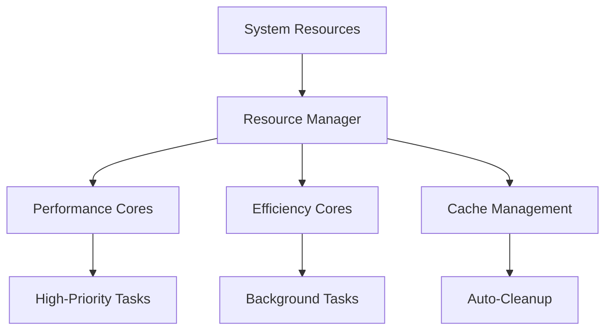
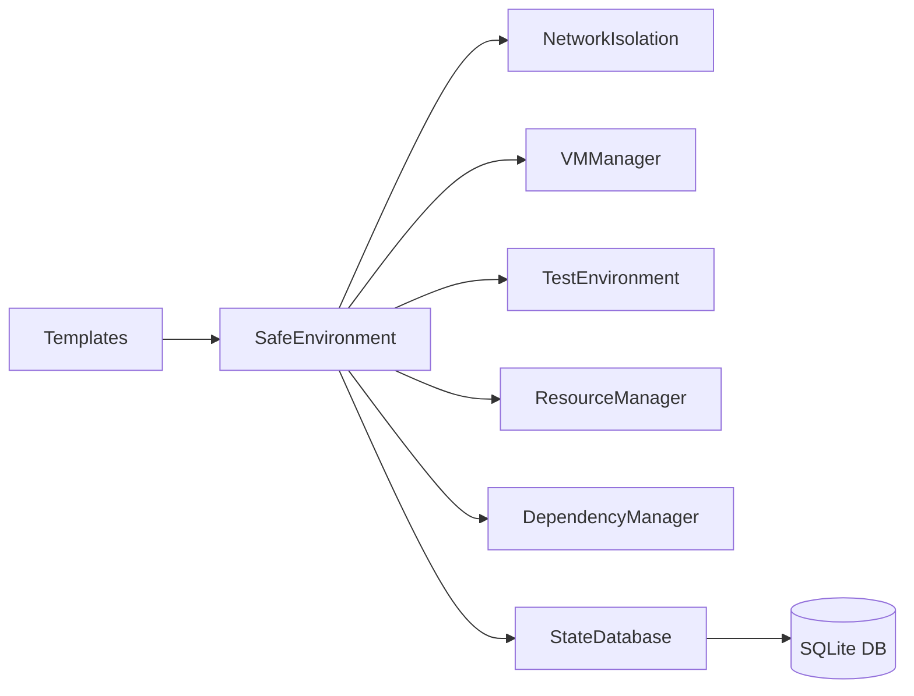

# SafeSpace

A comprehensive environment isolation and testing tool that creates secure, isolated environments with configurable features.

<div align="center">


</div>

## Core Features

| Feature | Description | Status |
|---------|-------------|--------|
| **Environment Isolation** | Create isolated filesystem environments | ✅ Implemented |
| **Resource Management** | Optimize resource allocation and caching | ✅ Implemented |
| **Template System** | Pre-configured environment templates | ✅ Implemented |
| **Network Isolation** | Create isolated network namespaces | ✅ Implemented |
| **VM Integration** | Lightweight virtual machines for complete isolation | ✅ Implemented |
| **Testing Framework** | Comprehensive testing environments | ✅ Implemented |
| **Dependency Management** | Built-in Python dependency management | ✅ Implemented |
| **Persistent Environments** | Save and recall environments across sessions | ✅ Implemented |

## Environment Template Types

<details>
<summary>Click to view available templates</summary>

| Template ID | Name | Description |
|-------------|------|-------------|
| `basic` | Basic Test | Basic testing environment with minimal configuration |
| `network` | Isolated Network | Environment with network isolation for testing network boundaries |
| `vm` | VM Based | Environment with VM support for isolated execution testing |
| `comprehensive` | Comprehensive | Full-featured environment with network isolation, VM, and enhanced testing |
| `development` | Enhanced Development | Environment optimized for development with IDE integration and tooling |
| `performance` | Performance Test | Environment configured for performance benchmarking and testing |

</details>

## Installation

```bash
# From PyPI
pip install safespace

# With optional dependencies
pip install safespace[network]  # For network isolation features
pip install safespace[vm]       # For VM features
pip install safespace[dev]      # For development
```

## Usage

### Basic Usage

```bash
# Create a basic isolated environment
safespace

# Create with network isolation
safespace --network

# Create with VM support
safespace --vm

# Create with comprehensive testing
safespace --test

# Create with enhanced development features
safespace --enhanced

# Create a persistent environment
safespace --persistent --name my-test-env
```

### Persistent Environments

```bash
# Create a persistent environment with a name
safespace --persistent --name my-test-env

# List all saved environments
safespace recall --list

# Recall a specific environment by name
safespace recall --name my-test-env

# Recall a specific environment by ID
safespace recall --id <environment-id>

# Delete a persistent environment
safespace recall --name my-test-env --delete

# Combine persistence with other features
safespace --persistent --name network-vm-env --network --vm
```

### Dependency Management

```bash
# Initialize dependency management for a project
safespace dep init

# Add dependencies
safespace dep add pytest click

# Add development dependencies
safespace dep add --dev black isort

# Install dependencies
safespace dep install

# Create a virtual environment with dependencies
safespace dep create-venv --venv .venv

# List installed packages
safespace dep list

# Check for dependency conflicts
safespace dep check

# Export dependencies to a file
safespace dep export --output requirements-dev.txt

# Convert between dependency formats
safespace dep convert requirements poetry
safespace dep convert poetry requirements
```

### Additional Configuration

```bash
# Configure VM resources
safespace --vm --memory=4G --cpus=4 --disk=20G

# Internal mode for persistent environments
safespace internal

# Clean up an environment
safespace --cleanup

# Completely remove an internal environment
safespace foreclose
```

## Resource Management

SafeSpace includes a sophisticated resource manager that:

- Intelligently allocates performance and efficiency cores
- Manages cache size and cleanup
- Optimizes resource usage based on system capabilities



## Architecture

SafeSpace uses a modular architecture with the following components:



## Testing Features

Environments can be configured with comprehensive testing capabilities:

- Directory structure for tests, source code, and configuration
- Pre-configured testing tools (pytest, pytest-cov, pytest-benchmark)
- Code quality tools (black, isort, mypy, ruff)
- Security scanning (safety, bandit)

## Environment Features

### Directory Structure

```
safe_env/
├── cache/      # Cache directory
├── logs/       # Log files
├── data/       # Environment data
├── tmp/        # Temporary files
└── .env        # Environment variables
```

### Enhanced Development Environment

- IDE support (VS Code settings)
- Git hooks (pre-commit configuration)
- CI/CD workflows
- Development scripts

### Package Management Integration

- Built-in dependency management with pip and poetry
- Virtual environment creation and management
- Dependency conflict detection
- Conversion between dependency formats
- Dependency export and import

## License

MIT

## Contributing

Contributions are welcome! Please feel free to submit a Pull Request.
